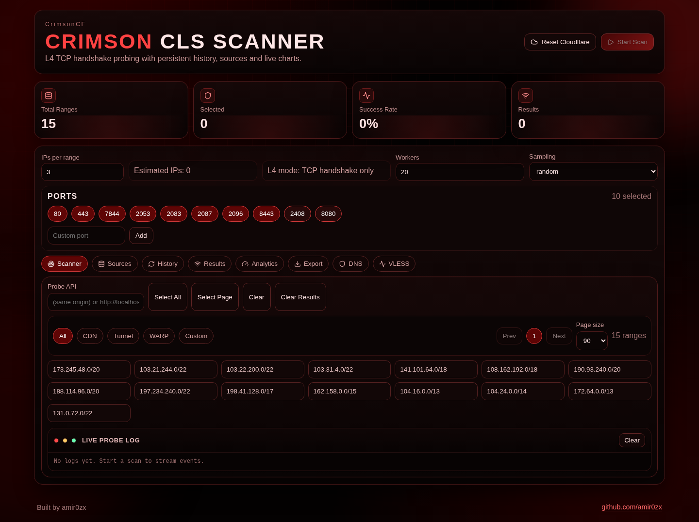

# CrimsonCF

[English](README.md) | [فارسی](README.fa.md)

**CrimsonCF (CrimsonCloudFlare)** is a fast **Cloudflare IP scanner web app** that tests endpoints using **Layer 4 (TCP handshake)** (not HTTPS), keeps scan history, exports clean newline TXT lists, and generates ready-to-import configs for **Xray-core**, **sing-box**, and **Clash**.



If you searched for: **cloudflare ip scanner**, **cloudflare ip range scanner**, **cloudflare tunnel ip scanner**, **warp ip scanner**, **fastest cloudflare ip**, this repo is built for that workflow.

## Features

- **L4 handshake probing** (TCP connect latency + open/closed)
- **Parallel scanning** (configurable concurrency)
- **IP range groups + paging**: CDN / Tunnel / WARP / Custom / All
- **Sources**: fetch ranges from URLs/APIs, presets for Cloudflare official lists
- **Results filters** + capability tags (CDN/Tunnel/WARP/BPB heuristics)
- **Exports**:
  - TXT (one IP per line, real newlines)
  - JSON/XLSX tables
  - Proxy configs: **Xray**, **sing-box**, **Clash (YAML/JSON)**
- **Cloudflare DNS tab**: push fastest IPs into A records automatically (replace mode)

## Quick Start (Docker Compose, recommended)

This runs the UI + probe server in one container.

```bash
docker compose up -d
```

Open:

- `http://localhost:8080`

## Why not HTTPS probes?

Many Cloudflare IPs won’t complete HTTPS the way you expect (SNI/certs/ciphers). CrimsonCF uses **TCP handshake tests** to reliably measure reachability/latency.

## Hosted UI vs running on user PC

Browsers block calling `http://localhost:...` from an `https://` hosted site (mixed content). If you want **real user-PC scanning**, run locally via Docker Compose.

## Cloudflare Workers build error: `Unauthorized`

If Cloudflare Git builds fail at `wrangler deploy` with `Unauthorized`, your build token is missing permissions.

Fix:

- In Cloudflare Workers Builds settings, create/use an API token that can deploy Workers + Containers + Durable Objects.
- Ensure the build environment has `CLOUDFLARE_API_TOKEN` and `CLOUDFLARE_ACCOUNT_ID` (if your build system doesn’t inject them automatically).

## Persian README

- `README.fa.md`

---

Built by `github.com/amir0zx` with help from OpenAI ChatGPT (Codex).
